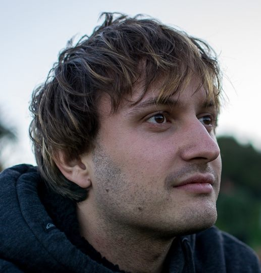

<iframe src="//www.ustream.tv/embed/16669704?wmode=direct" style="border: 0 none transparent;" frameborder="no" width="480" height="302"></iframe>

Πότε;
-----
Για δύο ώρες τη μέρα **18:00 - 20:00** σε 5 συναντήσεις:

1. **Παρασκευή 14 Φεβρουαρίου**
 * GPG & κρυπτογραφία
 * [Εισαγωγικές διαφάνειες](https://github.com/gtklocker/security-class/raw/master/slides/00_administrativa.pdf)
 * [Διαφάνειες](https://github.com/gtklocker/security-class/raw/master/slides/01_GPG.pdf)
 * Προτεινόμενη ανάγνωση: [GPG Handbook](http://www.gnupg.org/gph/en/manual.html)
 * [1η άσκηση](#exercises/1)
1. **Δευτέρα 17 Φεβρουαρίου**
 * HTTPS, HSTS, ARP, BREACH
 * [Διαφάνειες HTTPS](https://github.com/gtklocker/security-class/raw/master/slides/02_HTTPS.pdf)
 * [Διαφάνειες BREACH](https://github.com/gtklocker/security-class/raw/master/slides/02_BREACH.pdf)
1. **Τρίτη 18 Φεβρουαρίου**
 * Ασφάλεια web εφαρμογών
 * [Διαφάνειες](https://github.com/gtklocker/security-class/raw/master/slides/03_web.pdf)
1. **Τετάρτη 19 Φεβρουαρίου**
 * Tor, OTR, Bitcoin
 * [Διαφάνειες](https://github.com/gtklocker/security-class/raw/master/slides/04_Bitcoin.pdf)
1. Intermezzo: **Πέμπτη 20 Φεβρουαρίου**
 * Δεν θα γίνει μάθημα
 * Θα μαζευτούμε ανεπίσημα για απάντηση σε απορίες γύρω από το φαγητό
 * 18:00 - 20:00
 * Τσικνοπέμπτη: BBQ για όλους! Bring your own beer.
1. **Παρασκευή 21 Φεβρουαρίου**
 * Κρυπτογράφηση δίσκου, φυσικές επιθέσεις
 * [Διαφάνειες](https://github.com/gtklocker/security-class/raw/master/slides/05_Physical.pdf)

Πού;
----
**[The Cube](http://thecube.gr/)** στην Αθήνα, Κλεισόβης 8. [Δες εδώ πώς μπορείς να έρθεις](https://www.google.com/maps?daddr=The+Cube+Athens,+Klisovis+8,+Athina,+106+77,+Kentrikos+Tomeas+Athinon,+Greece&hl=en&sll=37.985406,23.732071&sspn=0.006291,0.011362&geocode=FX6cQwIdZx9qASGgaDKWpEDVASl9qh8gMb2hFDGgaDKWpEDVAQ&oq=The+Cube+Athens,+Klisovis+8,+Athina+106+77,+Greece&dirflg=r&ttype=now&noexp=0&noal=0&sort=def&mra=ls&t=m&z=17&start=0).

    <iframe src='webgl-seminar/demos/2-shading/6-companion-cube-shaded.html'></iframe>

Τι πρέπει να ξέρω;
------------------
Όχι πολλά.

* Για τις διαλέξεις 2 και 3 είναι καλό να έχεις [βασικές γνώσεις ανάπτυξης web εφαρμογών](http://web-seminar.softlab.ntua.gr/).
* Για το μεγαλύτερο μέρος του σεμιναρίου, δεν υπάρχουν προαπαιτούμενες γνώσεις!

Πού γράφομαι;
-------------
Απλά έλα!

* Το σεμινάριο είναι **δωρεάν**.
* Δεν απαιτείται εγγραφή.
* Μπορείς όμως να γραφτείς στη [λίστα μηνυμάτων μας στο Google Groups](https://groups.google.com/forum/#!forum/security-class-gr) ή να μπεις στην [ομάδα μας στο Facebook](https://www.facebook.com/groups/1449508148600922/).
* Δήλωσε ότι θα έρθεις στα Facebook events για να ξέρουμε πόσοι θα είμαστε.
* **Μην ξεχάσεις να φέρεις το laptop σου**! Θα "λερώσουμε τα χέρια μας".

Πώς μπορώ να βοηθήσω;
-----------------
Θα χαρούμε να διαφημίσεις το σεμινάριο στους φίλους σου και σε άλλα πρόσωπα που πιστεύεις πώς μπορεί να ενδιαφέρονται. Κοινοποίησε τη σελίδα μας ή εκτύπωσε το [φυλλάδιο του σεμιναρίου](images/flyer.jpg) και μοιράσου το στη σχολή σου ή στο χώρο εργασίας σου.

Ποιοι είστε;
------------
Είμαστε ο [Πέτρος](https://twitter.com/petrosagg) κι ο [Διονύσης](https://twitter.com/dionyziz), φοιτητές στο [πολυτεχνείο](http://ece.ntua.gr/).

<ul class="faces clearfix">
    <li></li>
    <li></li>
</ul>

Μας βοηθάνε επίσης ο [Σωκράτης](https://twitter.com/sokratisvidros), ο [Κωστής](https://twitter.com/gtklocker), ο [Γιώργος](https://void.gr/), ο **Λάζαρος**, ο [Νικόλας](https://twitter.com/Renelvon), ο [Γιώργος](https://twitter.com/sophron_) κι ο **Στέφανος**.

<ul class="faces clearfix">
    <li></li>
    <li></li>
    <li></li>
    <li></li>
    <li></li>
    <li></li>
    <li></a></li> 
</ul>
